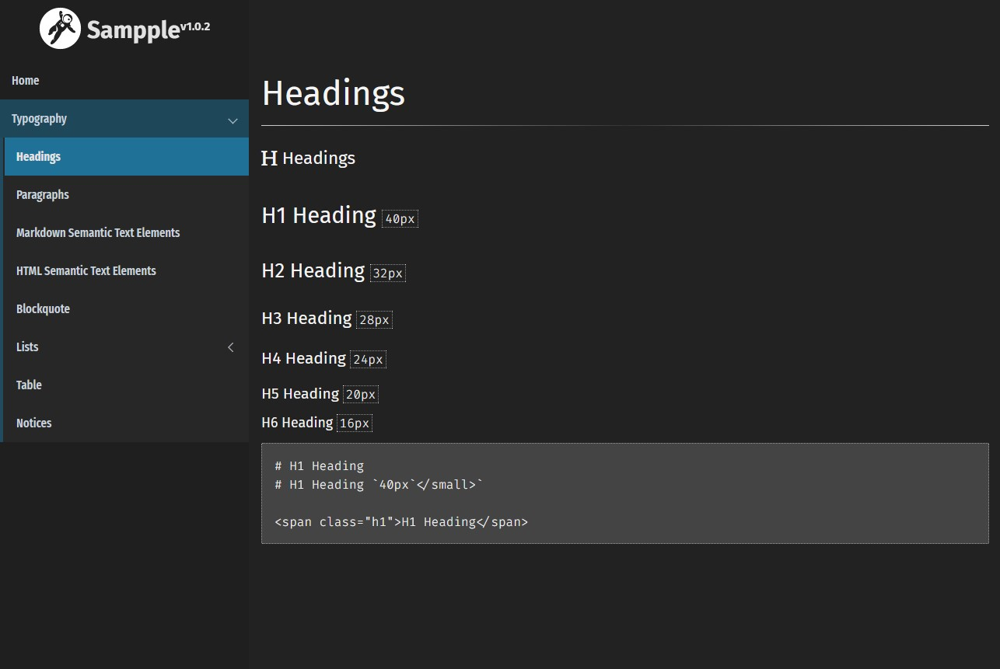

# Sampple Theme for Grav



**Sampple** is just a sample theme based on and inspired by [Vela](https://github.com/danzinger/grav-theme-vela) and [Learn2](https://github.com/getgrav/grav-theme-learn2)

# Installation

Installing the Sampple theme can be done in one of two ways. First you can clone the themes repository with a simple terminal command, while the manual method enables you to do so via a zip file. 

## Clone GitHub repository

Use your system's Terminal (also called the command line).  From the root of your Grav install type:

```cd user/themes
git clone https://github.com/cron-ix/grav-theme-sampple.git sampple/
```

This will install the Sampple theme into your `user/themes/sampple` directory within Grav. Its files can be found under `/your/site/grav/user/themes/sampple`.

## Download zip file

To install this theme, just download the zip version of this repository from [GitHub](https://github.com/cron-ix/grav-theme-sampple) and unzip it under `/your/site/grav/user/themes`. Then, rename the folder to `sampple`.

You should now have all the theme files under

    /your/site/grav/user/themes/sampple/